# Tensor Analysis for GRMHD Simulation

This repository focuses on building a custom parallel tensor analysis engine (C+MPI) to assist in general-relativistic magnetohydrodynamics (GRMHD) simulations of jets in active galactic nuclei (AGNs).

This project is part of the CS-6373: High Performance Computing course at The University of Tulsa under Professor Dr. Hale.

## Authors
Juniper-Marie Rahal, Isa Fite, Cameron Walker

## System Architecture

```mermaid
flowchart LR
    subgraph Phase1 [Phase 1: Simulation]
        A[Athena++ Solver] --> B(Fluid Evolution)
        B --> C[(HDF5 Conserved Datasets)]
    end

    subgraph Validation [Phase 2: Python Ground Truth]
        P1[h5py Extraction] --> P2[Root-Finding: Primitive Recovery]
        P2 --> P3[Reference Tensors & Math]
    end

    subgraph Phase3 [Phase 3: SPMD C+MPI Engine]
        D[MPI-IO Partitioning] --> E[Newton-Raphson: Primitive Recovery]
        E --> F[C+MPI Tensor Math]
        F --> G[Global MPI Reductions]
        G --> H[(Output: Tensor Datasets & Metrics)]
    end
    
    subgraph Phase4 [Phase 4: Visualizations]
        V1[Python / ParaView] --> V2[Heatmaps & Vector Fields]
        V1 --> V3[Scaling & Efficiency Plots]
    end

    %% Data Flow Connections
    C -->|Read Dummy Data| P1
    C -->|Parallel Read| D
    H -->|Read Results| V1
    
    %% Validation Connection (Dotted Line)
    P3 -.->|Validates Math via Unit Tests| F

    %% Styling
    style A fill:#630094,stroke:#333,stroke-width:2px,color:#fff
    style C fill:#13148c,stroke:#333,stroke-width:2px,color:#fff
    style H fill:#13148c,stroke:#333,stroke-width:2px,color:#fff
    style P3 fill:#a80096,stroke:#333,stroke-width:2px,stroke-dasharray: 5 5,color:#fff
    style V2 fill:#167600,stroke:#333,stroke-width:2px,color:#fff
    style V3 fill:#167600,stroke:#333,stroke-width:2px,color:#fff
```

## Prerequisites
To compile and run the code in this repository, your system must have the following installed:
* **C Compiler:** `gcc` or similar.
* **MPI Library:** OpenMPI or MPICH.
* **HDF5 Library:** Compiled with parallel (MPI) support enabled.
* **Python 3:** For running validation scripts and data visualization (`h5py`, `numpy`, `matplotlib`).

## Building the Engine
*(Instructions to be added once the Makefile is finalized)*

## Running the Athena++ Simulations
We use Athena++ to generate our baseline 2D relativistic jet datasets. Please refer to the `docs/` folder for our specific Athena++ configuration flags and initial conditions.
